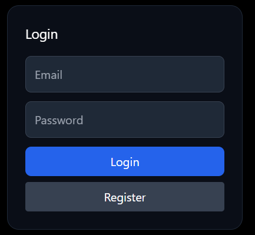
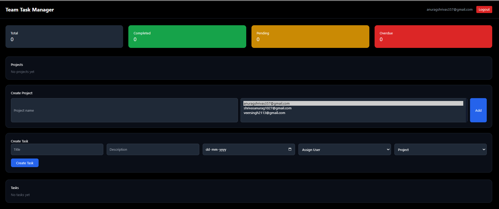
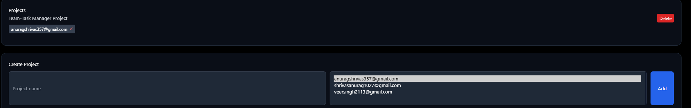
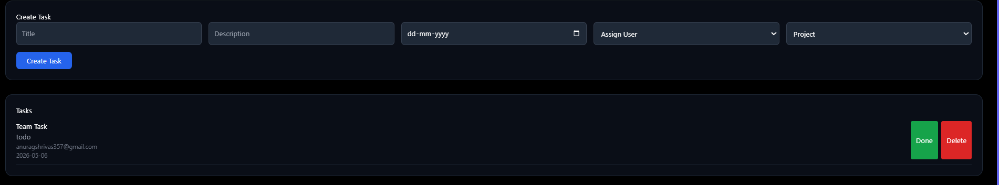

## This project 

This project is a Team Task Manager built using the MERN stack (MongoDB, Express.js, React.js, Node.js). It allows an admin to manage projects, assign users, create tasks, and track progress through a dashboard.

--------------------------------------------------

## Live Deployment

Railway Live Deployed Link:
https://team-task-manager-production-ea47.up.railway.app/

--------------------------------------------------

## Project Location (Local Setup)

The project was created inside the C drive.

Example path:
C:\team-task-manager

Structure:
C:\team-task-manager
  ├── client
  ├── server
  ├── screenshots
  └── demo

--------------------------------------------------

## Software Installed

Before starting the project, the following software was installed:

1. Node.js
- Downloaded from https://nodejs.org
- Used to run backend server and manage packages

2. npm
- Comes with Node.js
- Used to install dependencies

3. MongoDB
- Installed locally OR used MongoDB Atlas (cloud)
- Used as database

4. VS Code
- Used as code editor

5. Git (optional)
- Used for version control and GitHub

--------------------------------------------------

## Backend Setup (Server)

Step 1: Create backend folder

cd C:\team-task-manager
mkdir server
cd server

Step 2: Initialize project

npm init -y

Step 3: Install dependencies

npm install express mongoose cors dotenv jsonwebtoken bcryptjs

Step 4: Create files

- server.js
- .env
- models/
    - User.js
    - Task.js
    - Project.js
- routes/
    - auth.js
    - tasks.js
    - projects.js
    - users.js
- middleware/
    - auth.js

--------------------------------------------------

## Frontend Setup (Client)

Step 1: Create React app

cd C:\team-task-manager
npx create-react-app client
cd client

Step 2: Install dependencies

npm install axios framer-motion

--------------------------------------------------

## How to Run Project

Start backend:

cd server
node server.js

OR (if nodemon installed)

npx nodemon server.js

Start frontend:

cd client
npm start

Frontend runs on:
http://localhost:3000

Backend runs on:
http://localhost:5000

--------------------------------------------------

## Build for Production

To create production build of frontend:

cd client
npm run build

This creates:
client/build

This folder is used for deployment.

--------------------------------------------------

## Deployment (Railway)

Steps followed:

1. Created GitHub repository and pushed project
2. Logged into Railway using GitHub
3. Selected "Deploy from GitHub repo"
4. Selected project repository

Backend changes required:

- Added static serving:

const path = require("path");

app.use(express.static(path.join(__dirname, "../client/build")));

app.get("*", (req, res) => {
  res.sendFile(path.resolve(__dirname, "../client/build/index.html"));
});

- Updated PORT:

const PORT = process.env.PORT || 5000;

Frontend change:

const API = "";

Environment variables added in Railway:

MONGO_URI=your_mongodb_url
JWT_SECRET=your_secret

--------------------------------------------------

## Features Implemented

1. Authentication
- Register user
- Login user
- JWT authentication
- Token stored in localStorage

2. Project Management
- Create project
- Add multiple members
- Remove members
- Delete project

3. Task Management
- Create task
- Assign user
- Select project
- Add deadline
- Mark task as done
- Delete task

4. Dashboard
- Total tasks
- Completed tasks
- Pending tasks
- Overdue tasks

5. UI Features
- Dark theme UI
- Smooth animations using framer-motion
- Responsive layout

6. Member Selection (Important Feature)
- Select multiple users
- Selected users shown separately
- Remove user using ✕ button
- Assign user also removable

--------------------------------------------------

## Screenshots

Stored inside:
C:\team-task-manager\screenshots

Files:
- login.png
- dashboard.png
- create-project.png
- tasks.png

Usage in README:

--------------------------------------------------

## Demo Video

Stored inside:
C:\team-task-manager\demo

File:
demo.mp4

Note:
If file size is large, it can be uploaded to Google Drive or YouTube and link can be added here.

--------------------------------------------------

## API Endpoints

Auth:
POST /auth/register
POST /auth/login

Users:
GET /users

Projects:
GET /projects
POST /projects
DELETE /projects/:id
PUT /projects/:id/remove-member

Tasks:
GET /tasks
POST /tasks
PUT /tasks/:id
DELETE /tasks/:id

Dashboard:
GET /dashboard

--------------------------------------------------

## Environment Variables (.env)

Create a .env file inside server folder:

PORT=5000
MONGO_URI=your_mongodb_connection_string
JWT_SECRET=your_secret_key

--------------------------------------------------

## Notes

- Admin role is required to create projects and tasks
- Users are fetched dynamically from database
- UI updates automatically after API calls
- Axios is used for API communication
- State is managed using React useState and useEffect

--------------------------------------------------

## Summary

This is a complete full-stack task management system where:
- Backend handles APIs and database
- Frontend handles UI and interaction
- Users can collaborate via projects and tasks

--------------------------------------------------